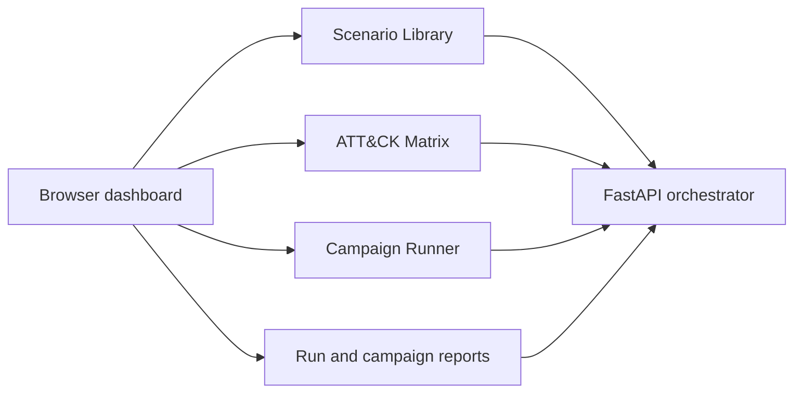
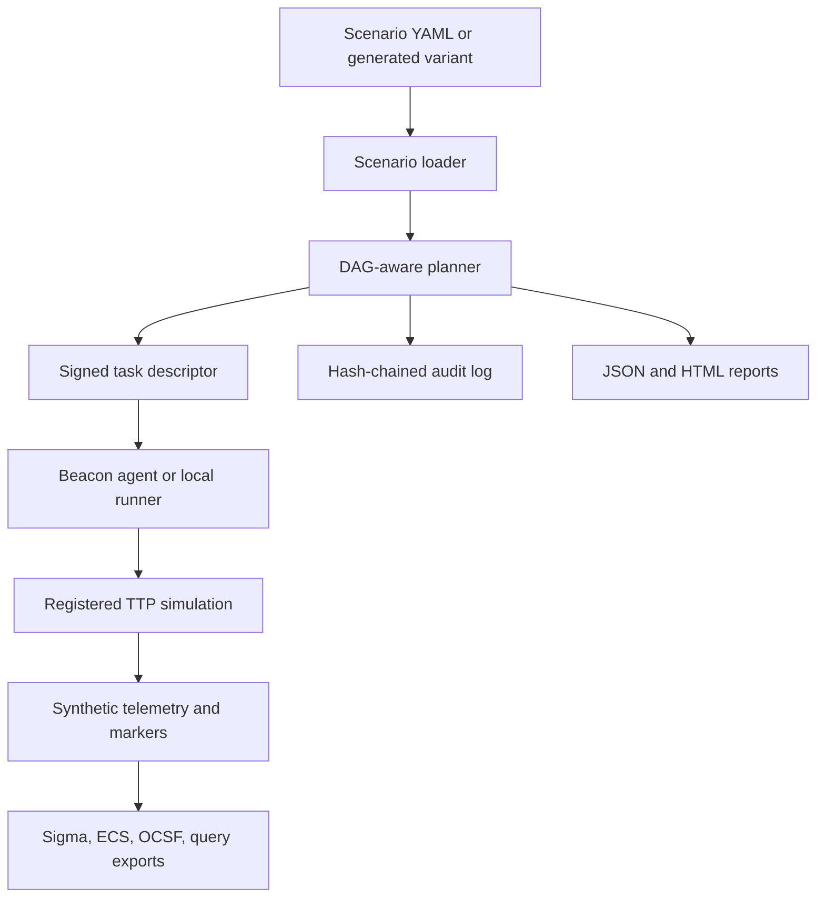
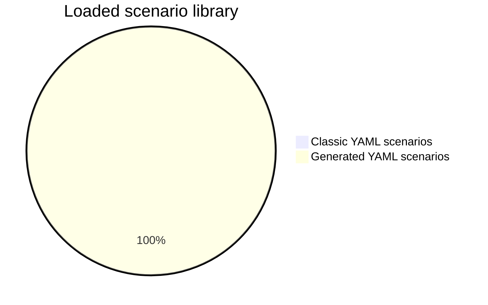
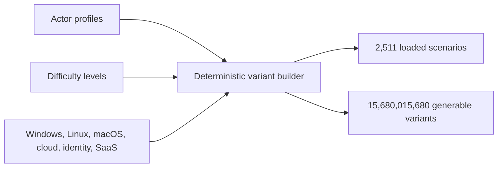

# APT Simulator

APT Simulator is a defensive ATT&CK emulation and detection-engineering lab project. It is built for authorized purple-team exercises, SOC training, SIEM rule validation, and offline telemetry testing.

It does not run destructive malware. The catalog-scale coverage added in this repository is marker-only and dry-run oriented by default.

## Project Snapshot

| Area | Current state |
| --- | --- |
| Coverage catalog | 5,000 TTPs mapped to ATT&CK Enterprise techniques and variants |
| Scenario library | 2,511 loaded scenarios available to the API and dashboard |
| Scenario sources | 11 classic YAML scenarios plus 2,500 generated YAML scenarios |
| Variant space | 15,680,015,680 generable scenario variants |
| Detection content | 5,000 Sigma rules with coverage metadata |
| ATT&CK scope | 14/14 ATT&CK Enterprise tactics covered, with scale at TTP and rule level |
| Safety default | Dry-run and marker-only behavior for generated scale coverage |



## Exact Current Counts

- 5,000 TTPs
- 2,511 loaded scenarios
- 11 classic YAML scenarios
- 2,500 generated YAML scenarios
- 15,680,015,680 generable scenario variants
- 5,000 Sigma rules
- 14/14 ATT&CK Enterprise tactics covered
- 100 ATT&CK-mapped marker-only variants in the `attack_variants` pack
- 4,149 ATT&CK scale variants in the `attack_scale_variants` pack

The 2,511 loaded scenarios are committed as complete YAML scenario definitions and are available through the orchestrator and dashboard. The larger deterministic variant space remains available for preview and controlled batch generation.

The ATT&CK Enterprise tactic layer has 14 tactics in this project model, so the advanced scale is expressed through TTP-level coverage: techniques, sub-techniques, platform variants, telemetry-source variants, SIEM-format variants, and fidelity variants.

## Runtime Graph



## Scenario Library Graph





## What This Project Does

- Loads ATT&CK-mapped TTPs from Python modules and catalog YAML.
- Runs scenario DAGs through a FastAPI orchestrator and beaconing agents.
- Provides a browser dashboard for coverage, scenario selection, campaign runs, reports, and event feed.
- Exports Sigma coverage, raw telemetry fixtures, ECS fixtures, OCSF fixtures, and simple SIEM query sketches.
- Builds scenario batches from deterministic variant space.
- Produces JSON and HTML reports for runs and campaigns.

## What This Project Does Not Do

- It is not an offensive framework.
- It is not intended for systems without written authorization.
- It stores the complete 2,511-scenario loaded library; larger variant batches are generated on demand.
- It does not contact cloud providers for the marker-only cloud simulations.
- It does not replace a full red-team engagement.

## Safety Model

- Dry-run parameters are enabled by default for generated scenarios.
- Marker-only TTPs produce benign telemetry and cleanup metadata.
- A central safety policy blocks higher-risk modes unless explicitly allowed.
- The orchestrator has a killswitch endpoint and file-based stop condition.
- Agents are intended for lab hosts defined by configuration.
- Audit logs record orchestrator and task activity.

## Project Layout

```text
orchestrator/   FastAPI app, planner, dashboard API, reports, scenario loader
agent/          Beacon agent and local runner
ttps/           TTP registry, Python TTPs, catalog-backed TTP packs
scenarios/      11 classic YAML scenarios plus 2,500 generated YAML scenarios
detection/      Sigma rules, coverage metadata, fixture/query export targets
profiles/       Actor profile inputs
config/         Default runtime and safety configuration
tests/          Unit, API, dashboard, coverage, and conformance tests
docs/           Supporting architecture and roadmap notes
```

## Install

```bash
python -m venv .venv
. .venv/Scripts/activate
pip install -e ".[dev]"
```

On Linux or macOS:

```bash
python -m venv .venv
. .venv/bin/activate
pip install -e ".[dev]"
```

## Run The Dashboard

```bash
python -m orchestrator.main serve --host 127.0.0.1 --port 8000
```

Open:

```text
http://127.0.0.1:8000/dashboard/
```

The dashboard includes:

| View | Purpose |
| --- | --- |
| Overview | Counts, coverage, detection score, and recent run state. |
| Scenario Library | Filter by actor, difficulty, platform, source, and scenario kind. |
| ATT&CK Matrix | Browse tactic coverage and technique gaps. |
| TTP Catalog | Search and filter registered TTPs and safety tiers. |
| Campaigns | Select 10, 50, or 100 scenarios, then pause, resume, or retry failed work. |
| Reports | Open JSON and HTML reports for runs and campaigns. |
| Event Feed | Watch recent orchestrator and simulation activity. |

## API Checks

Health and exact loaded scenario count:

```bash
curl http://127.0.0.1:8000/healthz
```

Scenario library:

```bash
curl http://127.0.0.1:8000/scenario-library
curl "http://127.0.0.1:8000/scenario-library?source=generated%20variant&platform=windows"
```

Variant-space count:

```bash
curl http://127.0.0.1:8000/scenario-builder/space
```

Preview one scenario:

```bash
curl "http://127.0.0.1:8000/scenario-builder/preview?actor=cloud-intrusion&difficulty=realistic&steps=12&seed=1&platforms=windows,linux,darwin"
```

Preview a scenario batch:

```bash
curl "http://127.0.0.1:8000/scenario-builder/batch-preview?count=25&offset=0&stride=6272006"
```

Run one loaded scenario:

```bash
curl -X POST http://127.0.0.1:8000/scenarios/run \
  -H "Content-Type: application/json" \
  -d "{\"name\":\"basic_recon\"}"
```

Start a campaign:

```bash
curl -X POST http://127.0.0.1:8000/campaigns/run \
  -H "Content-Type: application/json" \
  -d "{\"count\":10,\"source\":\"generated variant\"}"
```

Campaign reports:

```bash
curl http://127.0.0.1:8000/reports/campaigns/<campaign_id>.json
curl http://127.0.0.1:8000/reports/campaigns/<campaign_id>.html
```

Run reports:

```bash
curl http://127.0.0.1:8000/reports/runs/<run_id>.json
curl http://127.0.0.1:8000/reports/runs/<run_id>.html
```

## CLI Examples

Count the variant space:

```bash
python -m orchestrator.scenario_builder count-variants
python -m orchestrator.campaign count-variants
```

Generate a single scenario:

```bash
python -m orchestrator.scenario_builder generate \
  --actor cloud-intrusion \
  --difficulty realistic \
  --steps 12 \
  --seed 1 \
  --out scenarios/generated_campaign.yaml
```

Generate a bounded scenario batch:

```bash
python -m orchestrator.campaign build-variants \
  --count 1000 \
  --offset 0 \
  --stride 6272006 \
  --out scenarios/generated_variants.yaml
```

Materialize generated variants as individual YAML scenario files:

```bash
python -m orchestrator.campaign materialize-variants \
  --count 2500 \
  --offset 0 \
  --stride 6272006 \
  --out-dir scenarios/generated
```

Export Sigma rules:

```bash
python -m orchestrator.sigma_export export --out-dir detection/sigma
```

Export detection matrix fixtures and query sketches:

```bash
python -m orchestrator.detection_matrix fixtures --out-dir detection/fixtures
python -m orchestrator.detection_matrix queries --out-dir detection/queries
```

Run a local dry-run style scenario without the orchestrator:

```bash
python -m agent.main run-local scenarios/basic_recon.yaml --dry-run
```

## Testing

Run the full test suite:

```bash
pytest -q
```

Run linting:

```bash
ruff check .
```

Run type checks:

```bash
mypy orchestrator agent ttps
```

Run JavaScript syntax check:

```bash
node --check orchestrator/static/app.js
```

Conformance tests verify:

- TTP count is exactly 5,000.
- Loaded scenario count is exactly 2,511.
- README count statements match the current implementation.
- Public text files do not include forbidden public tooling markers.

## Loaded Scenario Model

The repository stores the complete loaded scenario library:

- `scenarios/*.yaml` contains 11 classic scenario files.
- `scenarios/generated/*.yaml` contains 2,500 generated scenario files.
- Each generated file is a complete scenario DAG with actor, target platforms, tags, steps, TTP IDs, parameters, and dependencies.
- The loader reads the full directory tree and loads all 2,511 scenarios directly.

## License

MIT. See `LICENSE`.
