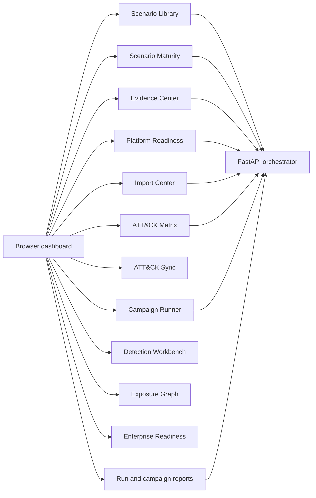
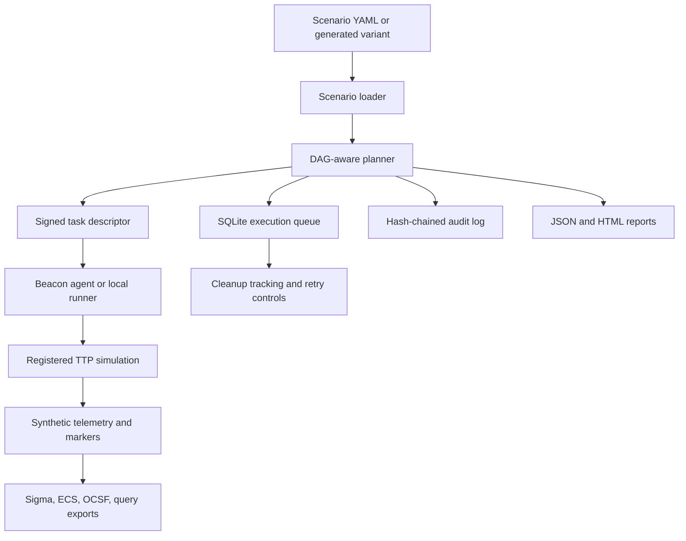
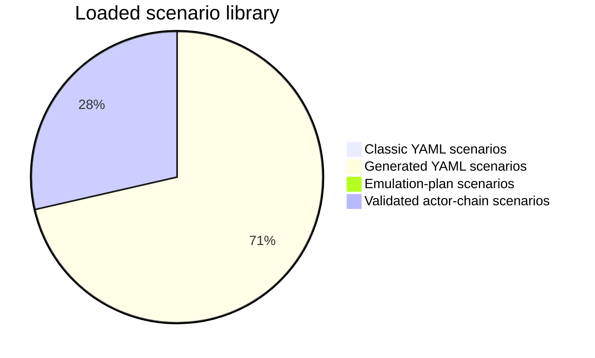
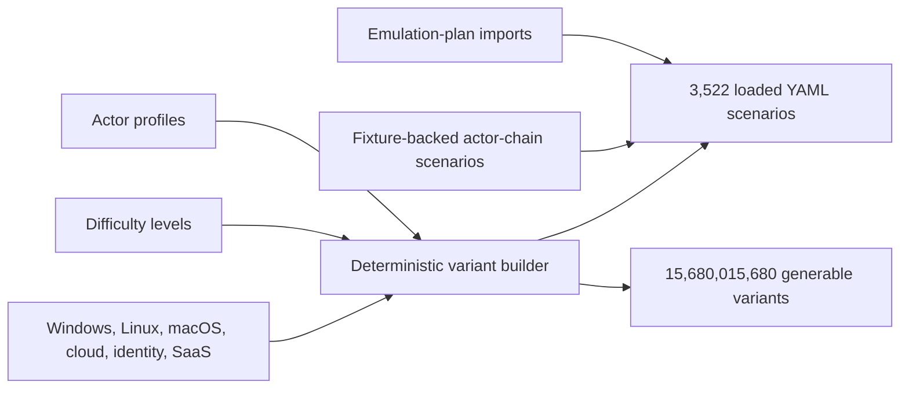
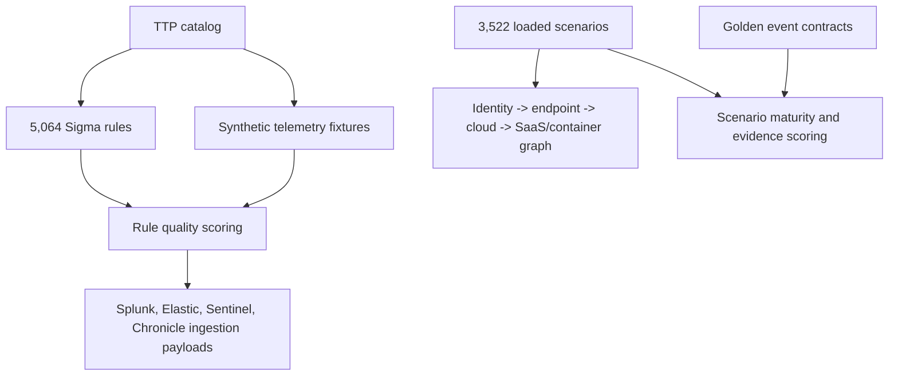

# APT Simulator

APT Simulator is a defensive ATT&CK emulation and detection-engineering lab project. It is built for authorized purple-team exercises, SOC training, SIEM rule validation, and offline telemetry testing.

It does not run destructive malware. The catalog-scale coverage added in this repository is marker-only and dry-run oriented by default.

## Project Snapshot

| Area | Current state |
| --- | --- |
| Coverage catalog | 5,064 TTPs mapped to ATT&CK Enterprise techniques and controlled variants |
| Scenario library | 3,522 loaded YAML scenarios available to the API and dashboard |
| Scenario sources | 11 classic YAML scenarios, 2,500 generated YAML scenarios, 11 emulation-plan scenarios, and 1,000 validated actor-chain scenarios |
| Scenario maturity | 1,000 fixture-backed validated actor-chain scenarios with 2,000 SOC golden event rows |
| Evidence exports | Global evidence ZIP and per-scenario evidence ZIP reports |
| Execution Engine v3 | Lab-safe multi-host dispatch model, local three-agent smoke, persistent queue, retry controls, cleanup tracking, and tamper-evident audit logs |
| SIEM ingestion | Splunk HEC, Elastic bulk, Microsoft Sentinel Data Collector, and Google Chronicle UDM connectors with local/private safety gate and mock-smoke tests |
| Enterprise readiness | 11 lab validation tracks, 8 hardening areas, 3 agent package targets with service wrappers, OIDC/JWKS RBAC, redacted secrets inventory, audit/backup export, real-lab evidence import, and long-campaign load plan |
| Official importers | ATT&CK STIX sync, ATT&CK Emulation Library importer, Atomic Red Team importer, cloud reference pack status, and rule-corpus comparison |
| Product readiness | 25-area Platform Readiness scorecard and downloadable benchmark ZIP with API snapshots |
| Variant space | 15,680,015,680 generable scenario variants |
| Detection content | 5,064 Sigma rules with coverage metadata and quality scoring |
| ATT&CK scope | 15/15 current ATT&CK Enterprise tactics covered, with snapshot drift checks |
| Safety default | Dry-run and marker-only behavior for generated scale coverage |



## Exact Current Counts

- 5,064 TTPs
- 3,522 loaded scenarios
- 11 classic YAML scenarios
- 2,500 generated YAML scenarios
- 11 emulation-plan YAML scenarios
- 1,000 validated actor-chain YAML scenarios
- 2,000 SOC golden event rows
- 15,680,015,680 generable scenario variants
- 5,064 Sigma rules
- 4 SIEM ingestion connector targets: Splunk HEC, Elastic bulk, Microsoft Sentinel Data Collector, and Google Chronicle UDM
- 11 enterprise validation tracks
- 3 agent package targets: Windows, Linux, and macOS, with Windows service, systemd, and launchd wrappers
- 5 load-test profiles up to 1,000 scenarios
- 4 SIEM validation targets: Splunk, Elastic, Microsoft Sentinel, and Google Chronicle
- 0 real-lab evidence records imported by default; `/lab-evidence/import` stores user-owned lab evidence in append-only JSONL
- 8 enterprise hardening areas: TTP quality, agent fleet, importer fidelity, cloud sandbox, secret backends, performance, compliance, public proof
- 4 cloud/Kubernetes sandbox profiles: AWS, Azure, GCP, Kubernetes
- 6 secret backend lanes: environment, local file, Vault, AWS Secrets Manager, Azure Key Vault, GCP Secret Manager
- 25 Platform Readiness areas
- 90-day default retention policy
- 15/15 current ATT&CK Enterprise tactics covered
- 696 current ATT&CK Enterprise base technique/sub-technique IDs tracked locally
- 100 ATT&CK-mapped marker-only variants in the `attack_variants` pack
- 4,149 ATT&CK scale variants in the `attack_scale_variants` pack
- 36 Cloud/Kubernetes lab TTPs in the `cloud_k8s_lab` pack
- 28 Active Directory/Windows enterprise lab TTPs in the `ad_enterprise_lab` pack

The 3,522 loaded scenarios are committed as complete YAML scenario definitions and are available through the orchestrator and dashboard. The larger deterministic variant space remains available for preview and controlled batch generation.

The 1,000 validated actor-chain scenarios are full scenario DAGs with fixture-backed SOC evidence contracts under `evidence/`. They are not counted as generated variants and are exposed separately in the Scenario Library and Scenario Maturity views.

The ATT&CK sync layer uses a bundled Enterprise STIX snapshot, detects missing, extra, deprecated, and revoked local technique IDs, and keeps the dashboard aligned to the current 15 tactic Enterprise model.

## Runtime Graph



## Scenario Library Graph





## Detection And Exposure Graph



## What This Project Does

- Loads ATT&CK-mapped TTPs from Python modules and catalog YAML.
- Runs scenario DAGs through a FastAPI orchestrator and beaconing agents.
- Provides a browser dashboard for coverage, scenario selection, campaign runs, reports, and event feed.
- Exports Sigma coverage, raw telemetry fixtures, ECS fixtures, OCSF fixtures, and simple SIEM query sketches.
- Sends committed SOC golden events to Splunk HEC, Elastic bulk, Microsoft Sentinel Data Collector, or Google Chronicle UDM compatible endpoints when a lab operator supplies endpoint credentials.
- Builds scenario batches from deterministic variant space.
- Produces JSON and HTML reports for runs and campaigns.
- Produces ZIP artifact bundles for persistent run history.
- Produces global and per-scenario evidence ZIP bundles for SOC review.
- Exposes Execution Engine v3 readiness for queue state, retry controls, cleanup tracking, and audit integrity.
- Exposes a local three-agent smoke endpoint that registers Windows, Linux, and macOS lab agents and dispatches independent DAG steps.
- Exposes SIEM connector status, payload previews, and guarded send endpoints for Splunk HEC, Elastic bulk, Microsoft Sentinel Data Collector, and Google Chronicle UDM ingestion.
- Exposes enterprise validation tracks for Windows AD, Linux fleet, AWS, Azure, GCP, Kubernetes, SaaS/Identity, Splunk, Elastic, Microsoft Sentinel, and Google Chronicle.
- Exposes agent packaging readiness for Windows, Linux, and macOS builds, including service wrapper artifacts.
- Exposes enterprise access, OIDC/JWKS validation status, RBAC matrix, and redacted secrets inventory.
- Imports external lab evidence records for scenarios, TTPs, SIEM exports, screenshots, and host logs.
- Exports audit logs as a ZIP with raw JSONL plus hash-chain verification manifest.
- Exposes long-campaign load-test profiles for 10, 50, 100, 500, and 1,000 scenario runs.
- Exposes an Import Center for ATT&CK STIX, ATT&CK Emulation Library, Atomic Red Team, cloud reference packs, and rule-corpus comparison.
- Exposes a Platform Readiness scorecard across execution, imports, evidence, detection, drift, graph, reports, labs, hardening, and benchmarks.
- Exposes enterprise hardening reports for TTP quality, fleet operations, official-source import fidelity, cloud sandbox guardrails, secret backends, performance, compliance, and public proof.
- Exports non-secret backup ZIP bundles for restore rehearsals.
- Produces a benchmark ZIP with current API snapshots and verification files.
- Tracks ATT&CK snapshot drift and detection-rule quality.
- Builds a controlled exposure graph from loaded scenarios and catalog domains.
- Scores scenario maturity using actor depth, DAG structure, tactic coverage, detection coverage, and evidence fixtures.

## What This Project Does Not Do

- It is not an offensive framework.
- It is not intended for systems without written authorization.
- It stores the complete 3,522-scenario loaded library; larger variant batches are generated on demand.
- Fixture-backed scenarios include expected telemetry contracts and mock-tested SIEM connector payloads.
- Real lab evidence is user-imported; no SIEM screenshots, host logs, or customer lab traces are bundled by default.
- Public SIEM URLs require explicit `allow_external=true`; localhost and private-network lab URLs are allowed by default.
- It does not contact cloud providers for the marker-only cloud simulations.
- It does not replace a full red-team engagement.

## Safety Model

- Dry-run parameters are enabled by default for generated scenarios.
- Marker-only TTPs produce benign telemetry and cleanup metadata.
- A central safety policy blocks higher-risk modes unless explicitly allowed.
- The orchestrator has a killswitch endpoint and file-based stop condition.
- Agents are intended for lab hosts defined by configuration.
- Audit logs record orchestrator and task activity.

## Project Layout

```text
orchestrator/   FastAPI app, planner, dashboard API, reports, scenario loader
agent/          Beacon agent and local runner
ttps/           TTP registry, Python TTPs, catalog-backed TTP packs
scenarios/      11 classic, 2,500 generated, 11 emulation-plan, and 1,000 validated YAML scenarios
evidence/       Scenario evidence contracts and SOC golden event fixtures
detection/      Sigma rules, coverage metadata, fixture/query export targets
profiles/       Actor profile inputs
config/         Default runtime and safety configuration
tests/          Unit, API, dashboard, coverage, and conformance tests
docs/           Supporting architecture and roadmap notes
```

Public verification notes live in `docs/PUBLIC_EVIDENCE.md`.

## Install

```bash
python -m venv .venv
. .venv/Scripts/activate
pip install -e ".[dev]"
```

On Linux or macOS:

```bash
python -m venv .venv
. .venv/bin/activate
pip install -e ".[dev]"
```

## Run The Dashboard

```bash
python -m orchestrator.main serve --host 127.0.0.1 --port 8000
```

Open:

```text
http://127.0.0.1:8000/dashboard/
```

The dashboard includes:

| View | Purpose |
| --- | --- |
| Overview | Counts, coverage, detection score, and recent run state. |
| Scenario Library | Filter by actor, difficulty, platform, source, and scenario kind. |
| Scenario Maturity | Review actor-chain depth, evidence status, detection coverage, and SOC usability score. |
| Evidence Center | Review quality gates, evidence coverage, telemetry spread, and download evidence ZIP bundles. |
| Platform Readiness | Review the 25-area scorecard, Execution Engine v3 readiness, multi-agent lab smoke, SIEM connectors, lab evidence import, enterprise hardening, enterprise validation, and benchmark export. |
| Import Center | Review official importer lanes, loaded content, source URLs, commands, and safety boundaries. |
| ATT&CK Matrix | Browse tactic coverage and technique gaps. |
| ATT&CK Sync | Check snapshot version, missing IDs, extra IDs, deprecated IDs, and revoked IDs. |
| TTP Catalog | Search and filter registered TTPs and safety tiers. |
| Campaigns | Select 10, 50, or 100 scenarios, schedule campaigns, repeat them, pause, resume, or retry failed work. |
| History | Read persistent run history, execution queue state, cleanup status, and ZIP artifacts. |
| Labs | Select Windows AD, Linux fleet, Cloud/Kubernetes, or SaaS/Identity lab profiles. |
| Access | Inspect RBAC roles and token issuance command. |
| Detection Workbench | Score Sigma quality, field gaps, false-positive risk, and SIEM target readiness. |
| Exposure Graph | Browse controlled identity, endpoint, cloud, SaaS, and container paths. |
| Reports | Open JSON and HTML reports for runs and campaigns. |
| Event Feed | Watch recent orchestrator and simulation activity. |

## API Checks

Health and exact loaded scenario count:

```bash
curl http://127.0.0.1:8000/healthz
```

Scenario library:

```bash
curl http://127.0.0.1:8000/scenario-library
curl "http://127.0.0.1:8000/scenario-library?source=generated%20variant&platform=windows"
curl "http://127.0.0.1:8000/scenario-library?source=validated%20actor-chain"
```

Scenario maturity and evidence:

```bash
curl http://127.0.0.1:8000/scenario-maturity
curl http://127.0.0.1:8000/evidence/summary
curl http://127.0.0.1:8000/scenario-evidence/validated_apt29_identity_cloud_chain
curl http://127.0.0.1:8000/reports/scenarios/validated_apt29_identity_cloud_chain.json
curl -o scenario-evidence.zip http://127.0.0.1:8000/reports/scenarios/validated_apt29_identity_cloud_chain.zip
curl -o evidence-pack.zip http://127.0.0.1:8000/reports/evidence-pack.zip
curl http://127.0.0.1:8000/history/runs
curl http://127.0.0.1:8000/execution/queue
curl http://127.0.0.1:8000/execution/v3/status
curl -X POST http://127.0.0.1:8000/labs/multi-agent/smoke
curl http://127.0.0.1:8000/lab-profiles
```

SIEM connector status, payload preview, and guarded send endpoints:

```bash
curl http://127.0.0.1:8000/siem/connectors/status
curl http://127.0.0.1:8000/siem/connectors/sample?limit=2
curl -X POST http://127.0.0.1:8000/siem/connectors/splunk/hec/send \
  -H "Content-Type: application/json" \
  -d "{\"url\":\"http://127.0.0.1:18088/services/collector/event\",\"token\":\"test-token\",\"event_limit\":2}"
curl -X POST http://127.0.0.1:8000/siem/connectors/elastic/bulk/send \
  -H "Content-Type: application/json" \
  -d "{\"url\":\"http://127.0.0.1:19200\",\"api_key\":\"test-key\",\"event_limit\":2}"
curl -X POST http://127.0.0.1:8000/siem/connectors/sentinel/data-collector/send \
  -H "Content-Type: application/json" \
  -d "{\"url\":\"http://127.0.0.1:18090/api/logs?api-version=2016-04-01\",\"workspace_id\":\"workspace-123\",\"shared_key\":\"<base64-shared-key>\",\"event_limit\":2}"
curl -X POST http://127.0.0.1:8000/siem/connectors/chronicle/udm/send \
  -H "Content-Type: application/json" \
  -d "{\"url\":\"http://127.0.0.1:18091/v2/udmevents:batchCreate\",\"bearer_token\":\"test-token\",\"event_limit\":2}"
```

Real-lab evidence import:

```bash
curl http://127.0.0.1:8000/lab-evidence/summary
curl http://127.0.0.1:8000/lab-evidence/template
curl -X POST http://127.0.0.1:8000/lab-evidence/import \
  -H "Content-Type: application/json" \
  -d "{\"source\":\"splunk\",\"evidence_type\":\"siem_export\",\"scenario\":\"validated_apt29_identity_cloud_chain\",\"attack_ids\":[\"T1078\"],\"artifact_ref\":\"file:///lab/splunk-export.json\"}"
```

Platform readiness, import status, and benchmark bundle:

```bash
curl http://127.0.0.1:8000/platform/readiness
curl http://127.0.0.1:8000/imports/center
curl -o benchmark-pack.zip http://127.0.0.1:8000/reports/benchmark-pack.zip
```

Enterprise validation, access, packaging, load-test, SIEM validation, and audit export:

```bash
curl http://127.0.0.1:8000/enterprise/readiness
curl http://127.0.0.1:8000/enterprise/access
curl http://127.0.0.1:8000/enterprise/lab-validation
curl http://127.0.0.1:8000/enterprise/agent-packaging
curl http://127.0.0.1:8000/enterprise/load-test/plan
curl http://127.0.0.1:8000/enterprise/siem-validation
curl http://127.0.0.1:8000/lab-evidence/summary
curl http://127.0.0.1:8000/enterprise/hardening
curl http://127.0.0.1:8000/enterprise/quality/ttps
curl http://127.0.0.1:8000/enterprise/fleet/readiness
curl http://127.0.0.1:8000/enterprise/import-fidelity
curl http://127.0.0.1:8000/enterprise/cloud-sandbox/readiness
curl http://127.0.0.1:8000/enterprise/secrets/backends
curl http://127.0.0.1:8000/enterprise/performance/plan
curl -X POST "http://127.0.0.1:8000/enterprise/performance/smoke?scenario_count=25"
curl http://127.0.0.1:8000/enterprise/compliance/readiness
curl http://127.0.0.1:8000/enterprise/public-proof/readiness
curl -o audit-export.zip http://127.0.0.1:8000/reports/audit-export.zip
curl -o backup-export.zip http://127.0.0.1:8000/reports/backup-export.zip
```

Variant-space count:

```bash
curl http://127.0.0.1:8000/scenario-builder/space
```

Preview one scenario:

```bash
curl "http://127.0.0.1:8000/scenario-builder/preview?actor=cloud-intrusion&difficulty=realistic&steps=12&seed=1&platforms=windows,linux,darwin"
```

Preview a scenario batch:

```bash
curl "http://127.0.0.1:8000/scenario-builder/batch-preview?count=25&offset=0&stride=6272006"
```

Run one loaded scenario:

```bash
curl -X POST http://127.0.0.1:8000/scenarios/run \
  -H "Content-Type: application/json" \
  -d "{\"name\":\"basic_recon\"}"
```

Start a campaign:

```bash
curl -X POST http://127.0.0.1:8000/campaigns/run \
  -H "Content-Type: application/json" \
  -d "{\"count\":10,\"source\":\"generated variant\"}"
```

Schedule a recurring campaign:

```bash
curl -X POST http://127.0.0.1:8000/campaigns/run \
  -H "Content-Type: application/json" \
  -d "{\"count\":10,\"source\":\"generated variant\",\"scheduled_at\":1781800000,\"repeat_interval_seconds\":3600,\"repeat_count\":3}"
```

ATT&CK sync status, detection workbench, and exposure graph:

```bash
curl http://127.0.0.1:8000/attack/sync/status
curl http://127.0.0.1:8000/detections/workbench
curl http://127.0.0.1:8000/exposure/graph
```

Campaign reports:

```bash
curl http://127.0.0.1:8000/reports/campaigns/<campaign_id>.json
curl http://127.0.0.1:8000/reports/campaigns/<campaign_id>.html
```

Run reports:

```bash
curl http://127.0.0.1:8000/reports/runs/<run_id>.json
curl http://127.0.0.1:8000/reports/runs/<run_id>.html
curl -o run-artifacts.zip http://127.0.0.1:8000/reports/runs/<run_id>.zip
curl http://127.0.0.1:8000/runs/<run_id>/cleanup-plan
curl -X POST http://127.0.0.1:8000/execution/v3/runs/<run_id>/retry-failed
curl -X POST http://127.0.0.1:8000/execution/v3/runs/<run_id>/cleanup
```

## CLI Examples

Count the variant space:

```bash
python -m orchestrator.scenario_builder count-variants
python -m orchestrator.campaign count-variants
```

Generate a single scenario:

```bash
python -m orchestrator.scenario_builder generate \
  --actor cloud-intrusion \
  --difficulty realistic \
  --steps 12 \
  --seed 1 \
  --out scenarios/generated_campaign.yaml
```

Generate a bounded scenario batch:

```bash
python -m orchestrator.campaign build-variants \
  --count 1000 \
  --offset 0 \
  --stride 6272006 \
  --out scenarios/generated_variants.yaml
```

Materialize generated variants as individual YAML scenario files:

```bash
python -m orchestrator.campaign materialize-variants \
  --count 2500 \
  --offset 0 \
  --stride 6272006 \
  --out-dir scenarios/generated
```

Export Sigma rules:

```bash
python -m orchestrator.sigma_export export --out-dir detection/sigma
```

Export detection matrix fixtures and query sketches:

```bash
python -m orchestrator.detection_matrix fixtures --out-dir detection/fixtures
python -m orchestrator.detection_matrix queries --out-dir detection/queries
```

Refresh the bundled ATT&CK snapshot:

```bash
python -m orchestrator.attack_sync snapshot --out config/attack_enterprise_snapshot.json
python -m orchestrator.attack_sync status --path config/attack_enterprise_snapshot.json
```

Import safe emulation-plan scenarios from a local plan checkout:

```bash
python -m orchestrator.emulation_plan_import scan <path-to-emulation-library>
python -m orchestrator.emulation_plan_import convert <path-to-emulation-library> --out-dir scenarios/ael
```

Score local detection content:

```bash
python -m orchestrator.detection_workbench score
python -m orchestrator.exposure_graph graph --out exposure-graph.json
python -m orchestrator.scenario_maturity summary
```

Regenerate the validated actor-chain scenario pack:

```bash
python tools/generate_validated_pack.py --target 1000 --refresh-generated
```

The maturity report separates generated variants from validated actor-chain scenarios, tracks evidence-backed scenarios, and surfaces missing evidence for static or imported scenarios. The 1,000 validated scenarios include Sigma match references, ECS fields, OCSF categories, SIEM fields, detection latency targets, report expectations, and 2,000 golden SOC events.

## Lab Profiles

The dashboard and `/lab-profiles` endpoint expose four practical lab tracks:

- Windows AD Lab: domain login, discovery, credential marker, lateral movement, policy and service markers.
- Linux Fleet Lab: shell, cron, transfer, archive, C2, and cleanup markers.
- Cloud/Kubernetes Lab: cloud access, metadata, Kubernetes discovery, role binding, deployment, and escape signal markers.
- SaaS/Identity Lab: password spray, MFA policy, risky sign-in, token creation, collection, and external sharing markers.

Run a local dry-run style scenario without the orchestrator:

```bash
python -m agent.main run-local scenarios/basic_recon.yaml --dry-run
```

## Enterprise Readiness

The `/enterprise/readiness` endpoint combines the production-facing readiness surfaces:

- 11 lab validation tracks: Windows AD, Linux fleet, AWS, Azure, GCP, Kubernetes, SaaS/Identity, Splunk, Elastic, Microsoft Sentinel, and Google Chronicle.
- 8 enterprise hardening areas: TTP quality, fleet operations, import fidelity, cloud sandbox, secret backends, performance, compliance, and public proof.
- 3 agent packaging targets: Windows, Linux, and macOS, with service wrapper artifacts.
- OIDC/JWKS RBAC with viewer, operator, and admin roles.
- Redacted secrets inventory with 6 backend lanes: environment, local file, Vault, AWS Secrets Manager, Azure Key Vault, and GCP Secret Manager.
- Audit export ZIP with hash-chain verification manifest.
- Backup export ZIP with database, audit JSONL, config, manifest, and restore rehearsal checklist.
- Real-lab evidence import summary and append-only JSONL registry.
- 5 long-campaign load-test profiles: 10, 50, 100, 500, and 1,000 scenarios.

Production deployment guidance is in `docs/PRODUCTION_DEPLOYMENT.md`. Lab validation guidance is in `docs/ENTERPRISE_VALIDATION.md`.

## Testing

Run the full test suite:

```bash
pytest -q
```

Run linting:

```bash
ruff check .
```

Run type checks:

```bash
mypy orchestrator agent ttps
```

Run JavaScript syntax check:

```bash
node --check orchestrator/static/app.js
```

Conformance tests verify:

- TTP count is exactly 5,064.
- Loaded scenario count is exactly 3,522.
- Validated actor-chain scenario count is exactly 1,000.
- SOC golden event row count is exactly 2,000.
- README count statements match the current implementation.
- ATT&CK tactic coverage is exactly 15/15 and drift status is synced.
- Enterprise readiness reports exactly 11 validation tracks, 8 hardening areas, 3 package targets, 5 load-test profiles, 4 SIEM validation targets, and real-lab evidence record counts.
- Platform readiness reports exactly 25 areas.
- Public text files do not include forbidden public tooling markers.

## Loaded Scenario Model

The repository stores the complete loaded scenario library:

- `scenarios/*.yaml` contains 11 classic scenario files.
- `scenarios/generated/*.yaml` contains 2,500 generated scenario files.
- `scenarios/ael/*.yaml` contains 11 emulation-plan scenario files.
- `scenarios/validated/*.yaml` contains 1,000 fixture-backed validated actor-chain scenario files.
- `evidence/soc_golden_events.jsonl` contains two golden event rows per validated scenario, 2,000 rows total.
- Each generated file is a complete scenario DAG with actor, target platforms, tags, steps, TTP IDs, parameters, and dependencies.
- The loader reads the full directory tree and loads all 3,522 scenarios directly.

## License

MIT. See `LICENSE`.
