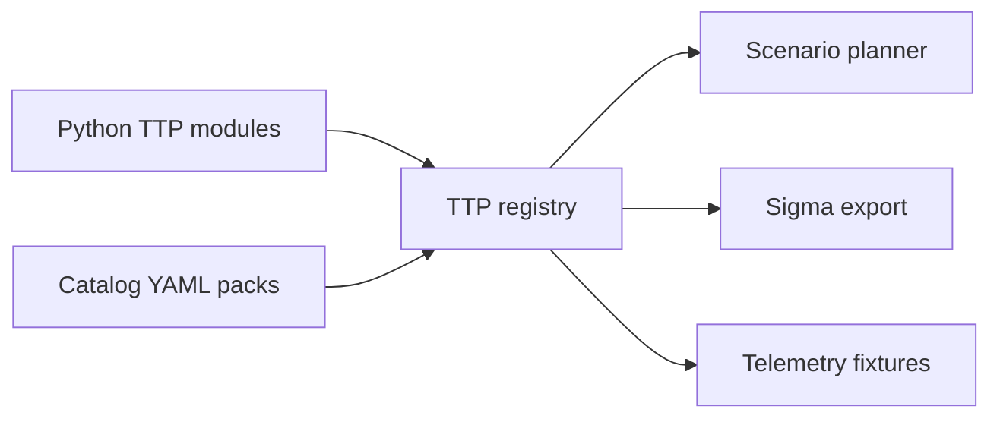

# Architecture

## Components

### Orchestrator (`orchestrator/`)

FastAPI server. Holds the in-memory `Planner` for active runs and step states,
an `AuditLog` with a hash-chained JSONL stream, a `KillSwitch`, and the loaded
scenario catalog. It issues signed task descriptors to agents on beacon.

Modules:

- `core/config.py` - pydantic config models and YAML loader.
- `core/killswitch.py` - checks env var `APT_SIM_STOP` and a flag file.
- `core/audit.py` - append-only JSONL with sha256 chain (`prev` to `hash`).
- `core/signer.py` - Ed25519 keygen, sign, verify.
- `core/planner.py` - Run / StepState and DAG-aware task dispatch.
- `dsl/schema.py` - pydantic models for scenarios and DAG validation.
- `dsl/loader.py` - YAML scenario loader.
- `api/` - FastAPI routers (`agents`, `scenarios`, `ttps`, `killswitch`).
- `scenario_maturity.py` - scenario depth, evidence, detection coverage, and SOC usability scoring.
- `main.py` - Typer CLI: `serve`, `verify-audit`.

### Agent (`agent/`)

- `safety.py` - pre-flight killswitch and lab whitelist checks.
- `runtime.py` - TTP loader and signature verifier.
- `beacon.py` - register, poll, execute, report, and TTL self-terminate.
- `main.py` - CLI: `apt-agent run --server URL`.

### TTPs (`ttps/`)

Plugin library where each Python module or catalog item self-registers on
import. The current registry loads 5,064 TTPs/variants:

| Surface | Purpose |
| --- | --- |
| Python modules | Simulations that need custom local logic, bounded reads, lab writes, or protocol behavior. |
| Catalog YAML | Marker-only scale coverage with metadata, params, Sigma, telemetry, and cleanup fields. |
| ATT&CK enterprise pack | Broad ATT&CK Enterprise technique coverage from catalog entries. |
| Controlled variant pack | Additional ATT&CK-mapped marker-only variants for OS, telemetry, and scenario diversity. |
| Scale variant pack | Thousands of deterministic marker-only variants across telemetry sources, SIEM formats, and fidelity profiles. |
| Cloud/Kubernetes and AD packs | Marker-only enterprise lab coverage for cloud, container, identity, and Windows directory telemetry. |

## Data Flow

1. Operator calls `POST /scenarios/run` by name or inline scenario body.
2. Planner instantiates a `Run` and expands steps into `StepState` records.
3. Each agent beacon calls `next_task_for_agent`; the planner returns a ready step whose dependencies are all `success`.
4. Task is signed with Ed25519 over canonical JSON before transmission.
5. Agent verifies signature, runs the registered TTP, then posts the result.
6. Planner cascades `abort_on_fail`; when all steps are terminal, the run completes.
7. Every state transition is audit-logged in the hash-chained JSONL stream.
8. Scenario maturity reports correlate the loaded DAG, evidence contract, golden events, tactics, and detection coverage.

## Safety Guardrails

- Killswitch: env or file flag causes the orchestrator to abort runs and agents to exit on next check.
- Lab whitelist: agent refuses to start outside allowed hostnames/CIDRs.
- Signed payloads: agent rejects unsigned tasks when key enforcement is configured.
- TTL: agent self-terminates after `--ttl-seconds` (default 4 h).
- Allowlisted commands: T1059 cannot run arbitrary shell commands.
- Isolated registry path: T1547 cannot touch real Run keys.
- Hash-chained audit: tampering with any past audit line breaks `verify-audit`.

## Current Scale

- 5,064 registered TTPs/variants.
- 2,534 loaded YAML scenarios.
- 12 fixture-backed validated actor-chain scenarios.
- 5,064 Sigma rules.
- 15/15 current ATT&CK Enterprise tactics covered.
- Dashboard, campaign runner, reports, coverage matrix, scenario library, scenario maturity, sync status, detection workbench, and exposure graph are implemented.
