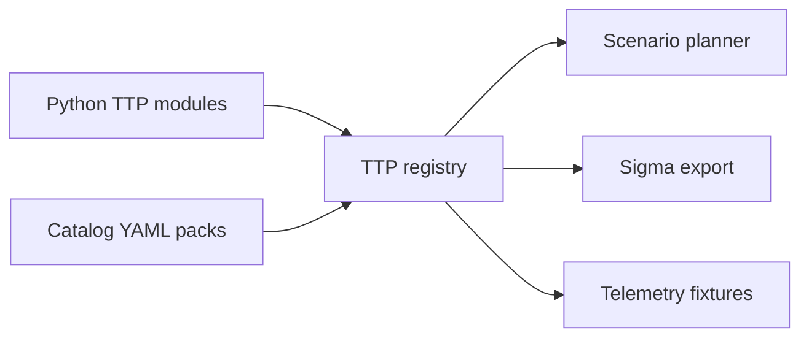

# Architecture

## Components

### Orchestrator (`orchestrator/`)

FastAPI server. Holds the in-memory `Planner` (active runs + step states), an
`AuditLog` (hash-chained JSONL), a `KillSwitch`, and the loaded `Scenario`
catalog. Issues signed task descriptors to agents on beacon.

Modules:

- `core/config.py` — pydantic config models, YAML loader.
- `core/killswitch.py` — checks env var `APT_SIM_STOP` and a flag file.
- `core/audit.py` — append-only JSONL with sha256 chain (`prev` → `hash`).
- `core/signer.py` — Ed25519 keygen, sign, verify (CLI: `python -m orchestrator.core.signer init`).
- `core/planner.py` — Run / StepState; DAG-aware task dispatch.
- `dsl/schema.py` — pydantic models for scenarios + DAG validation.
- `dsl/loader.py` — YAML loader.
- `api/` — FastAPI routers (`agents`, `scenarios`, `ttps`, `killswitch`).
- `main.py` — Typer CLI: `serve`, `verify-audit`.

### Agent (`agent/`)

- `safety.py` — pre-flight: killswitch + lab whitelist.
- `runtime.py` — TTP loader + signature verifier.
- `beacon.py` — register → poll → execute → report. TTL self-terminate.
- `main.py` — CLI: `apt-agent run --server URL`.

### TTPs (`ttps/`)

Plugin library, each Python module or catalog item self-registers on import.
The current registry loads 5,064 TTPs/variants:

| Surface | Purpose |
| --- | --- |
| Python modules | Simulations that need custom local logic, bounded reads, lab writes, or protocol behavior. |
| Catalog YAML | Marker-only scale coverage with metadata, params, Sigma, telemetry, and cleanup fields. |
| ATT&CK enterprise pack | Broad ATT&CK Enterprise technique coverage from catalog entries. |
| Controlled variant pack | Additional ATT&CK-mapped marker-only variants for OS, telemetry, and scenario diversity. |
| Scale variant pack | Thousands of deterministic marker-only variants across telemetry sources, SIEM formats, and fidelity profiles. |
| Cloud/Kubernetes and AD packs | Marker-only enterprise lab coverage for cloud, container, identity, and Windows directory telemetry. |

## Data flow

1. Operator `POST /scenarios/run` (by name or inline).
2. Planner instantiates a `Run`, expands steps into `StepState` dict.
3. Each agent on beacon calls `next_task_for_agent` → planner returns a step
   whose dependencies are all `success`.
4. Task is signed (Ed25519 over canonical JSON) before transmission.
5. Agent verifies signature → runs the registered TTP → POSTs result.
6. Planner cascades `abort_on_fail`. When all steps terminal → run completes.
7. Every state transition is audit-logged (hash-chained JSONL).

## Safety guardrails (recap)

- Killswitch (env or file) — orchestrator aborts runs, agents exit on next beacon or local check.
- Lab whitelist — agent refuses to start outside allowed hostnames/CIDRs.
- Signed payloads — agent rejects unsigned tasks when key is configured.
- TTL — agent self-terminates after `--ttl-seconds` (default 4 h).
- Allowlisted commands — T1059 cannot run arbitrary shell.
- Isolated registry path — T1547 cannot touch real Run keys.
- Hash-chained audit — tamper with any past line breaks `verify-audit`.

## Current Scale

- 5,064 registered TTPs/variants.
- 2,522 loaded YAML scenarios.
- 5,064 Sigma rules.
- 15/15 current ATT&CK Enterprise tactics covered.
- Dashboard, campaign runner, reports, coverage matrix, scenario library, sync status, detection workbench, and exposure graph are implemented.
